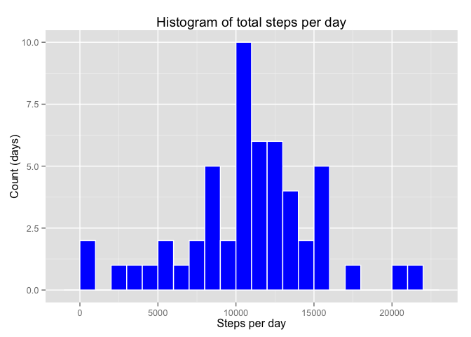
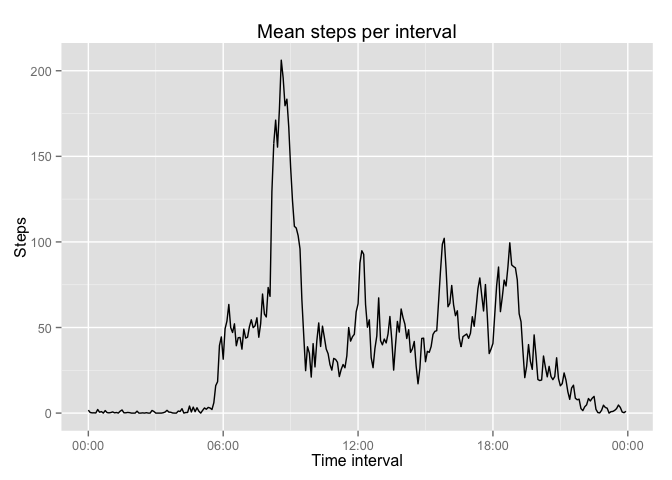
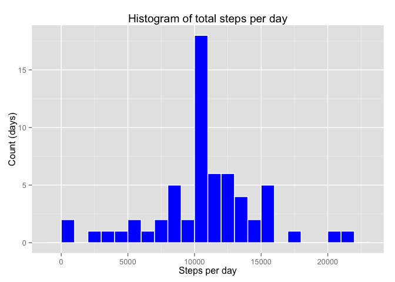
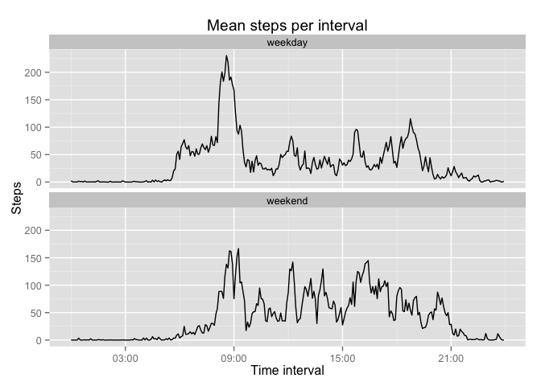

# Reproducible Research: Peer Assessment 1


## Loading and preprocessing the data

1. Load the data (i.e. `read.csv()`)

A simple way to load the activity data in R is to use the base R functions
`read.csv` and `unz` like this:


```r
rawdata <- read.csv(unz("activity.zip", "activity.csv"),
                    colClasses = c(steps = "integer",
                                   date = "character",
                                   interval = "integer"))
```

2. Process/transform the data (if necessary) into a format suitable for your
analysis

For processing dates and times (the `date` and `interval` fields), we used the 
`lubridate` package, with the `dplyr` package to mutate the data frame adding a
new column `datetime`:


```r
library(dplyr)
library(lubridate)
pdata <- rawdata %>%
  mutate(datetime = ymd(date) +
           hours(rawdata$interval %/% 100) +
           minutes(rawdata$interval %% 100))
```

## What is mean total number of steps taken per day?

1. Make a histogram of the total number of steps taken each day


```r
library(ggplot2)
aggdata <- pdata %>%
  group_by(date) %>%
  summarize(steps = sum(steps))
ggplot(aggdata) +
  aes(steps) +
  stat_bin(binwidth = 1000,
           color = "white",
           fill = "blue") +
  labs(title = "Histogram of total steps per day",
       x = "Steps per day",
       y = "Count (days)")
```

 

2. Calculate and report the **mean** and **median** total number of steps taken 
per day


```r
library(knitr)
aggdata <- aggdata %>%
  ungroup() %>%
  filter(!is.na(steps)) %>%
  summarise_each(funs(Minimum = min,
                      Median = median,
                      Mean = mean,
                      Maximum = max), steps)
row.names(aggdata) <- "Steps per day"
kable(aggdata, format = "markdown")
```


|              | Minimum| Median|     Mean| Maximum|
|:-------------|-------:|------:|--------:|-------:|
|Steps per day |      41|  10765| 10766.19|   21194|

## What is the average daily activity pattern?

1. Make a time series plot (i.e. `type = "l"`) of the 5-minute interval (x-axis)
and the average number of steps taken, averaged across all days (y-axis)


```r
library(scales)
aggdata <- pdata %>%
  filter(!is.na(steps)) %>%
  group_by(interval) %>%
  summarize(datetime = min(datetime), steps = mean(steps))
ggplot(aggdata, aes(datetime, steps)) +
  geom_line() +
  scale_x_datetime(labels = date_format("%R")) +
  labs(title = "Mean steps per interval",
       x = "Time interval",
       y = "Steps")
```

 

2. Which 5-minute interval, on average across all the days in the dataset,
contains the maximum number of steps?


```r
maxsteps <- aggdata %>% filter(steps == max(steps))
maxsteps_interval <- format(maxsteps$datetime, "%R")
```

On average, the 5-minute interval containing the maximum number of steps is
**08:35**.

## Imputing missing values

1. Calculate and report the total number of missing values in the dataset (i.e. the total number of rows with `NA`s)


```r
na_rows <- sum(is.na(pdata$steps))
```

There are **2304** missing values in the dataset.

2. Devise a strategy for filling in all of the missing values in the dataset. The strategy does not need to be sophisticated. For example, you could use the mean/median for that day, or the mean for that 5-minute interval, etc.

There are several days in the dataset with no data (missing data for all 5-minute intervals in that day), as the table below shows:


```r
days_intervals <- pdata %>%
  group_by(date) %>%
  summarize(complete = sum(!is.na(steps)))
na_days <- days_intervals %>%
  filter(complete == 0)
kable(na_days, format = "markdown")
```


|date       | complete|
|:----------|--------:|
|2012-10-01 |        0|
|2012-10-08 |        0|
|2012-11-01 |        0|
|2012-11-04 |        0|
|2012-11-09 |        0|
|2012-11-10 |        0|
|2012-11-14 |        0|
|2012-11-30 |        0|

Therefore, imputting missing values based on the average for the day would not work for these days.


```r
na_intervals <- pdata %>%
  group_by(interval) %>%
  summarize(complete = sum(!is.na(steps))) %>%
  filter(complete == 0) %>%
  nrow()
```

However, there are **0** 5-minute intervals where data is missing in every day of the dataset. This means an average value can be computed for every interval, which yields a better strategy for imputting missing values.

3. Create a new dataset that is equal to the original dataset but with the missing data filled in.


```r
interval_means <- pdata %>%
  filter(!is.na(steps)) %>%
  group_by(interval) %>%
  summarize(steps = mean(steps))

impdata <- pdata %>%
  left_join(interval_means, by = "interval") %>%
  mutate(steps = ifelse(is.na(steps.x),
                        round(steps.y),
                        steps.x)) %>%
  select(-steps.x, -steps.y)
kable(head(impdata), format = "markdown")
```


|date       | interval|datetime            | steps|
|:----------|--------:|:-------------------|-----:|
|2012-10-01 |        0|2012-10-01 00:00:00 |     2|
|2012-10-01 |        5|2012-10-01 00:05:00 |     0|
|2012-10-01 |       10|2012-10-01 00:10:00 |     0|
|2012-10-01 |       15|2012-10-01 00:15:00 |     0|
|2012-10-01 |       20|2012-10-01 00:20:00 |     0|
|2012-10-01 |       25|2012-10-01 00:25:00 |     2|

4. Make a histogram of the total number of steps taken each day and Calculate and report the **mean** and **median** total number of steps taken per day. Do these values differ from the estimates from the first part of the assignment? What is the impact of imputing missing data on the estimates of the total daily number of steps?

This is the same histogram as before (same bins, parameters etc), but now 
constructed after missing data has been imputted:


```r
library(ggplot2)
aggdata <- impdata %>%
  group_by(date) %>%
  summarize(steps = sum(steps))
ggplot(aggdata) +
  aes(steps) +
  stat_bin(binwidth = 1000,
           color = "white",
           fill = "blue") +
  labs(title = "Histogram of total steps per day",
       x = "Steps per day",
       y = "Count (days)")
```

 

The impact so far seems to be only that the tallest bar in the histogram 
got taller (corresponding to the mean **and** median, as shown in the 
previous sections), where all the other ones remained at the same values.

This can be better understood by examining the data some more. As previously
demonstrated, there are 8 days in the dataset where no activity has been
recorded (missing data). But what about days with **partial activity**, that
is, where the data for only a few of the 5-minute intervals is missing? This
can be shown with the table below:


```r
days_intervals %>%
  count(complete) %>%
  kable(format = "markdown")
```


| complete|  n|
|--------:|--:|
|        0|  8|
|      288| 53|

As the table shows, there have only been days where all data is missing, or days
where all data (288 complete observations) is present. So all that data
imputation did was add 8 more days to the dataset where the number of steps is
the mean. This is why the histogram bar corresponding to the mean increased by 8
days where all other bars remained the same.

## Are there differences in activity patterns between weekdays and weekends?

1. Create a new factor variable in the dataset with two levels -- "weekday" and
"weekend" indicating whether a given date is a weekday or weekend day.


```r
impdata_w <- impdata %>%
  mutate(weekend = ifelse(wday(datetime) %in% c(1, 7),
                          "weekend", # weekend means Sat or Sun
                          "weekday")) %>%
  mutate(weekend = as.factor(weekend))
kable(head(impdata_w), format = "markdown")
```


|date       | interval|datetime            | steps|weekend |
|:----------|--------:|:-------------------|-----:|:-------|
|2012-10-01 |        0|2012-10-01 00:00:00 |     2|weekday |
|2012-10-01 |        5|2012-10-01 00:05:00 |     0|weekday |
|2012-10-01 |       10|2012-10-01 00:10:00 |     0|weekday |
|2012-10-01 |       15|2012-10-01 00:15:00 |     0|weekday |
|2012-10-01 |       20|2012-10-01 00:20:00 |     0|weekday |
|2012-10-01 |       25|2012-10-01 00:25:00 |     2|weekday |

2. Make a panel plot containing a time series plot (i.e. `type = "l"`) of the
5-minute interval (x-axis) and the average number of steps taken, averaged
across all weekday days or weekend days (y-axis).


```r
activity_w <- impdata_w %>%
  # trick - use today + (HH:MM from interval) as datetime, so it can later
  # be used in the ggplot X axis to print the interval as HH:MM
  mutate(datetime = as.POSIXct(today()) +
           hours(hour(datetime)) +
           minutes(minute(datetime))) %>%
  group_by(weekend, datetime) %>%
  summarize(steps = mean(steps))
ggplot(activity_w) +
  aes(datetime, steps) +
  geom_line() +
  scale_x_datetime(labels = date_format("%R")) +
  facet_wrap(~weekend, nrow = 2) +
  labs(title = "Mean steps per interval",
       x = "Time interval",
       y = "Steps")
```

 
